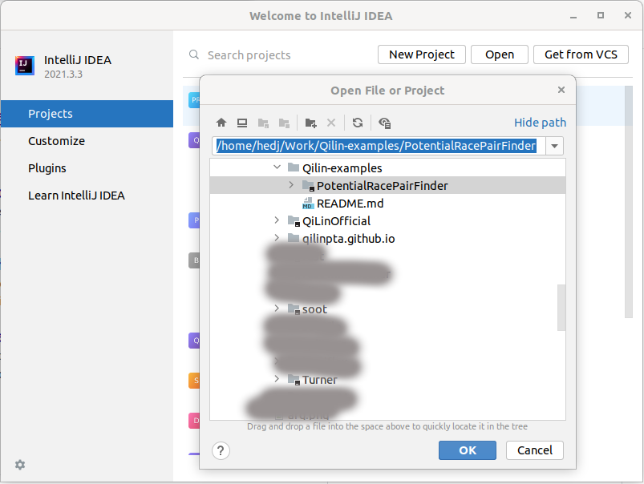
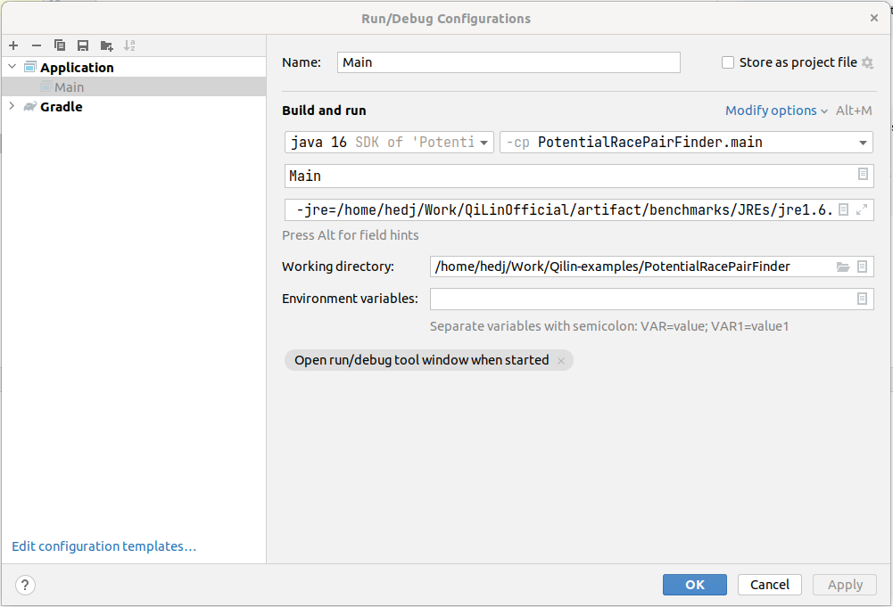
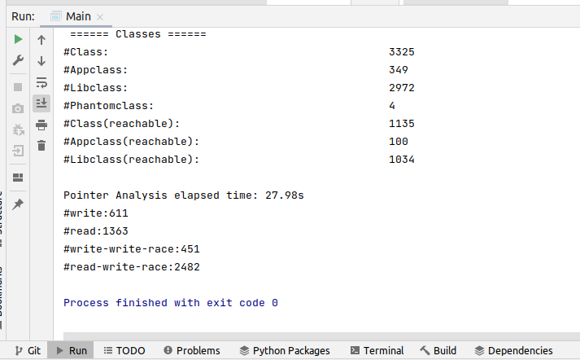

# PotentialRacePairFinder
This example shows how to find the potential data races in the application code of a program.

We define the potential data race pair as follow:
1. Two field-write statements "b1.f = a1" and "b2.f = a2" s.t. mayAlias(b1, b2).
2. Onw field-read statement "a1 = b1.f" and one field-write statement "b2.f = a2" s.t. mayAlias(b1, b2).

## Build from the command line

Use the following command to build the project:
```commandline
./gradlew fatjar
```

Use the following command to test `luindex`:
```commandline
java -jar build/libs/PotentialRacePairFinder-1.0-SNAPSHOT.jar -lcs -mh -pta=T-2o -apppath /home/hedj/Work/QiLinOfficial/artifact/benchmarks/dacapo2006/luindex.jar -reflectionlog /home/hedj/Work/QiLinOfficial/artifact/benchmarks/dacapo2006/luindex-refl.log -libpath /home/hedj/Work/QiLinOfficial/artifact/benchmarks/dacapo2006/luindex-deps.jar -mainclass dacapo.luindex.Main -jre=/home/hedj/Work/QiLinOfficial/artifact/benchmarks/JREs/jre1.6.0_45
```

You will get the following dumping information:
```commandline
Pointer Analysis elapsed time: 22.39s
#write:611
#read:1389
#write-write-race:451
#read-write-race:2517
```

## Build with IntelliJ IDEA

1. import the project



2. setup the parameters



3. run and get the results


